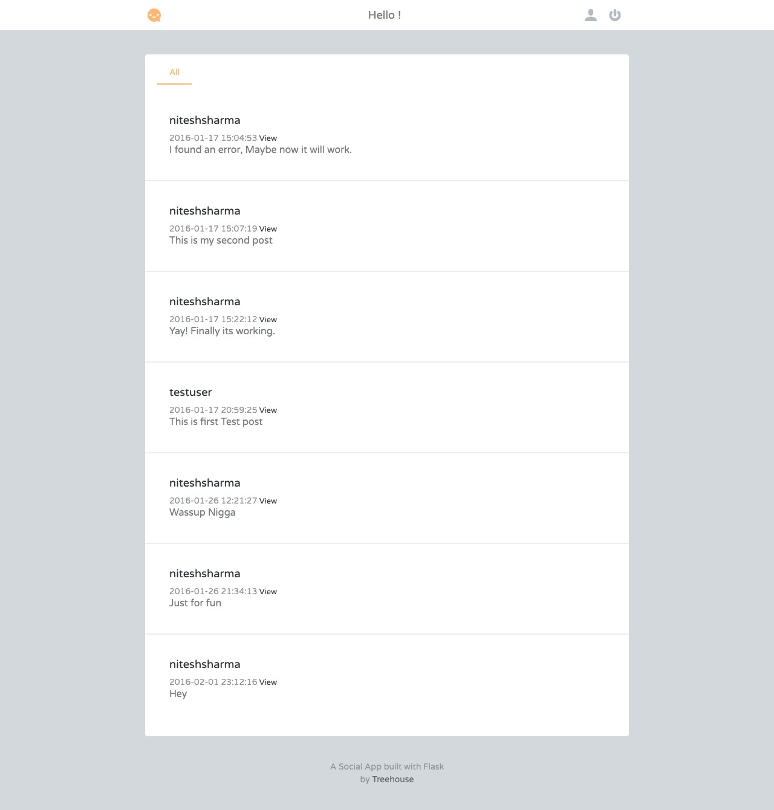

# Flask-Social-Networking
This is a Small Social Networking website developed using Flask and Peewee. It uses Jinja-2 templating engine. 

# Requirements

Python version >= 2.7

Before starting package needed following to be installed

``pip install flask peewee flas-login flask-bcrypt email_validator``
_flask-bcrypt (It uses the blue fish cipher)_

# Platform Specification
Runs on Mac OSX, Windows, Linux.

# Installation
fork the github [Repository.](https://github.com/sinscary/Flask-Social-Networking.git) 

Run following line in terminal to install dependencies
```bash
  pip install -r requirements.txt
```

To run
```bash
  python app.py
```

Fire up your browser and visit
```http
  http://localhost:8000
```

Screenshot
